<!-- V 1.0, Riccardo Ferrari, 2026-06-12 -->

# Hack a Wind Farm v1.0 Documentation
-----------

Dear participant,

Welcome to the first edition of the **Hack a Wind Farm Hackathon**. The purpose of this event is to let you interact with and hack the industrial control system of a virtual wind farm (Fig. 1). The main components of the virtual wind farm are:

* A real-time simulator that implements a realistic model of each wind turbine and its local control system
* A Supervisory Control and Data Acquisition (SCADA) system that provides control and monitoring functions for the entire wind farm
* An API that allows you to easily implement a Man-in-the-Middle (MitM) attack

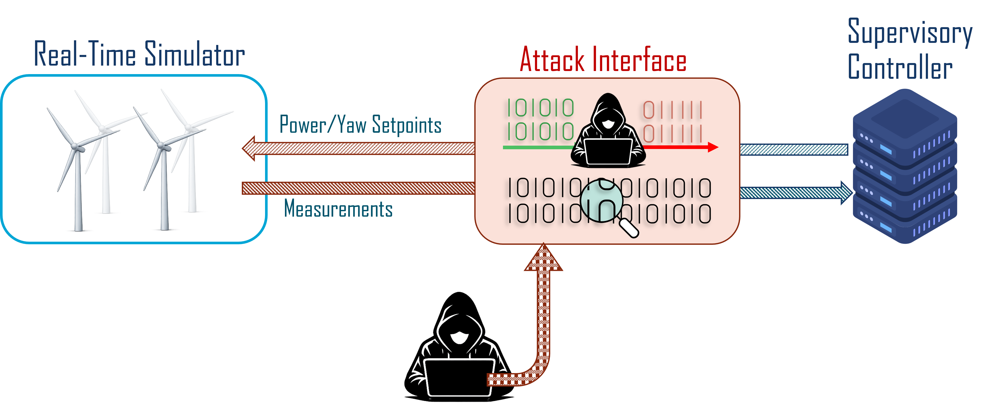
*Fig. 1: An overview of the hackathon architecture.*

This document describes the wind farm used in the hackathon from both a physical and a cyber point of view. It first gives a brief description of how wind farms and wind turbines operate, followed by a detailed description of the hardware and software that implement the wind farm Industrial Control System (ICS), which comprises the wind turbine local controllers and the SCADA. Finally, rules and goals for participants are provided.

## Physical domain: operation of wind farms and wind turbines

This section provides a basic description of:

- Wind Turbine Generator (WTG) operating principles and control systems
- Wind farm control

For more details, we suggest the following scientific papers, as well as related work:

> [1] S. Boersma et al., ‘A tutorial on control-oriented modeling and control of wind farms’, in 2017 American Control Conference (ACC), May 2017, pp. 1–18. doi: 10.23919/ACC.2017.7962923.

> [2] J.-W. Van Wingerden, L. Pao, J. Aho, and P. Fleming, ‘Active Power Control of Waked Wind Farms’, IFAC-PapersOnLine, vol. 50, no. 1, pp. 4484–4491, Jul. 2017, doi: 10.1016/j.ifacol.2017.08.378.

### Wind Turbine Generators

WTGs convert (a fraction of) the power available in the wind flow into electrical power (see Fig. 2).

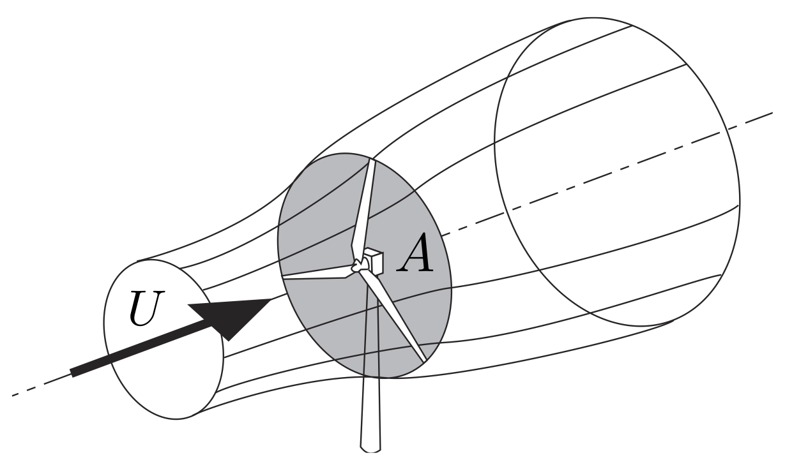
*Fig. 2: Conceptual illustration of the wind flow, with initial undisturbed velocity $U$, crossing the area $A$ swept by the rotor of the WTG. In doing so, the wind flow loses kinetic energy, which is captured by the WTG. The slowed down and more turbulent flow behind the turbine is called the **wake**.*

An illustration of a typical offshore, horizontal axis WTG is provided below.

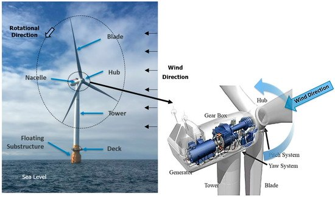
*Fig. 3: Picture (left) of a typical offshore WTG, and illustration (right) of the main components involved in energy capture.*

From the point of view of this hackathon, the components of interest are:

**The rotor**: it converts part of the available aerodynamic power in the wind flow into mechanical power. It comprises three blades whose **pitch angles** can be controlled.

**The electric generator**: it converts part of the mechanical power from the rotor into electric power. It is connected to the rotor via a gearbox and its **torque** can be controlled.

While most of the physical dimensions of a WTG are not relevant for the present scope, the following angles are important (Fig. 4):

**Yaw angle $\gamma$** between the wind direction and the rotor axis, measured in a horizontal plane

**Pitch angle $\beta$** of the blades, where $\beta=0^\circ$ means that the blades have their chords lying in the rotor plane and $\beta=90^\circ$ means the blade chords are aligned with the rotor axis.

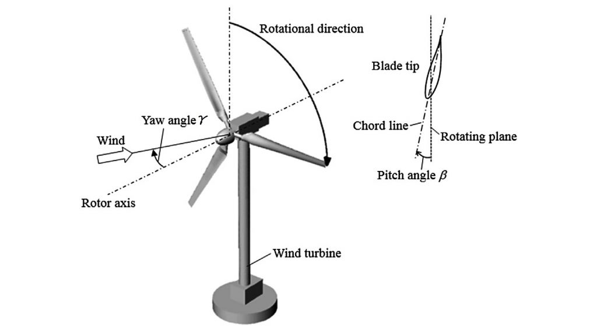
*Fig. 4: Illustration of the yaw angle $\gamma$ (left) and the pitch angle $\beta$ (right).*

The aerodynamic power available to be captured by the WTG rotor can be modelled with the following equation:

$$P_r = C_p(\beta,\lambda,\gamma)\frac{1}{2}\rho A U^3$$

where $\lambda = \frac{\omega_r R}{U}$ is the *tip speed ratio*, $\omega_r$ is the rotor rotational speed in rad/s, and $R$ is the rotor radius. The function $C_p(\beta,\lambda,\gamma)$ is called the *power coefficient* and defines which fraction of the available wind power is captured by the rotor for a given operating condition of the turbine.

It is important to stress that $P_r$ is not the actual power captured by the WTG and converted to electrical power: it is only the available power that can be extracted from the wind flow.
How much power is generated depends on the way the electrical generator is controlled. The power that the generator can extract from the drive train is $P_g = \omega_g \tau_g$, where $\tau_g$ is the controlled torque opposed by the generator, $\omega_g = N \omega_r$ is the generator speed, and $N$ is the gearbox ratio.

In a steady-state condition, the generator is controlled such that $P_g = P_r$, which means that the rotational speed $\omega_r$ will remain constant. If $P_g>P_r$, the rotor will necessarily slow down, as it needs to trade its kinetic energy to make up for the power difference. If $P_g<P_r$, it will accelerate.

In order to prevent the rotor from accelerating too much and exceeding its nominal rotational speed, each WTG is provided with a local control system that controls the yaw angle $\gamma$ and the pitch angle $\beta$ to regulate the power $P_r$, and the generator torque $\tau_g$ to regulate the power $P_g$.

How exactly the controller computes the desired control actions is beyond the scope of this document. It is instead important that the WTG controller behaviour depends on the wind speed, which is divided into three operating regions (Fig. 5).

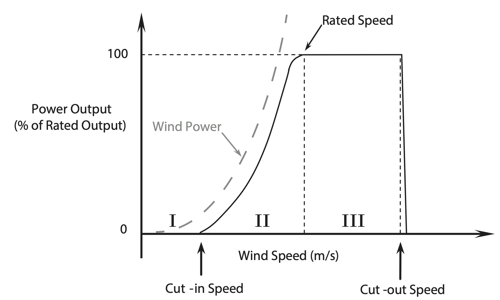
*Fig. 5: Operating regions of a WTG and power curve as a function of the wind speed.*

**Region I** is for wind speeds below a minimum value, called the *cut-in speed*. The brakes are applied and the turbine is idle. No power is produced.

**Region II** is between the *cut-in speed* and the *rated speed*. The pitch angle $\beta$ is kept constant at an optimum value, while the generator torque is controlled such that the turbine can accelerate up to an optimal rotational speed $\omega_r$. In this way, the resulting $C_p$ is optimal and the turbine reaches an operating condition where the highest amount of power is extracted from the wind.

**Region III** is above the *rated speed*, but below the *cut-out speed*. When the rated speed is reached, the turbine is producing the maximum power $P_{g,\text{max}}$ for which the generator is rated. To avoid overspeeding and overloading the generator, the pitch angle $\beta$ is controlled such that $P_r = P_{g,\text{max}}$. When the wind speed exceeds the *cut-out speed*, which is the maximum at which it can safely operate, the turbine brakes are engaged until it stops and it remains idle, producing no power.

Ideally, one would like to operate the turbine such that the yaw angle $\gamma = 0$, which corresponds to the turbine facing directly into the wind. This allows the turbine to capture the maximum amount of power from the wind.

Most WTG controllers can nevertheless operate in a way that produces a reference amount of power $P_{\text{ref}}$ that is lower than the maximum. This can be obtained by controlling the blade pitch and generator torque or, in extreme cases, by yawing away from the wind direction. Both reference signals, $P_{\text{ref}}$ and $\gamma_{\text{ref}}$, are provided externally to the WTG control system, as depicted in Fig. 6.

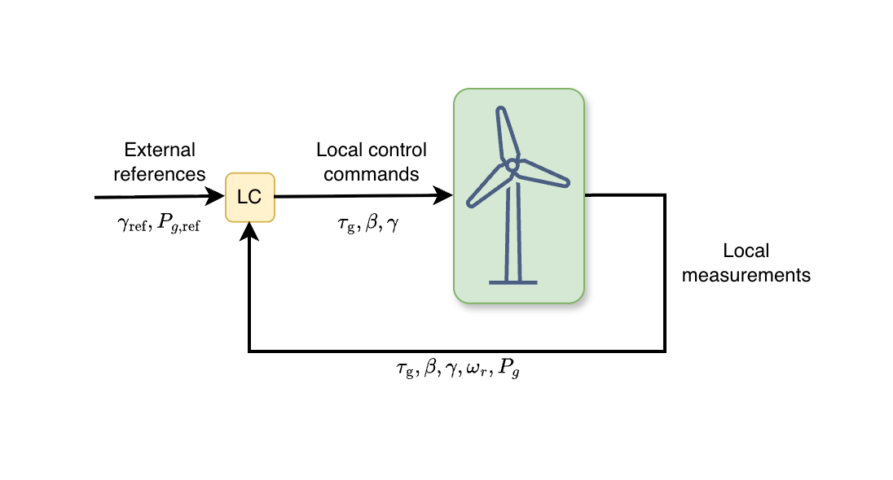
*Fig. 6: Block diagram of a WTG control system (Local Controller -> LC). While the same symbols are used, for instance, for the control command for the pitch angle $\beta$ and its measurement, they are different quantities. In particular, the actual physical pitch angle, and thus its measurement, does not react instantly to a change in its control command, as the pitch actuator needs some time to rotate the blade.*

Why and how we need to operate a WTG below its maximum power, that is, in a *derated* condition, is explained in the next subsection.

Initially, WTG control systems were designed to let the turbine generate the maximum possible power. As wind energy started to play a larger role in the electricity grid and large wind farms were built, it became clear that the amount of power generated by a WTG also needs to be controlled in order to match demand. This is important to keep the electric grid stable, and it also brings some benefits to WTGs because their lifetime can be extended. This is particularly true in wind farms where multiple WTGs are closely packed and are generally affected by the wakes of upstream turbines. The wake, being a slower and more turbulent flow, negatively affects downstream turbines (Fig. 7).

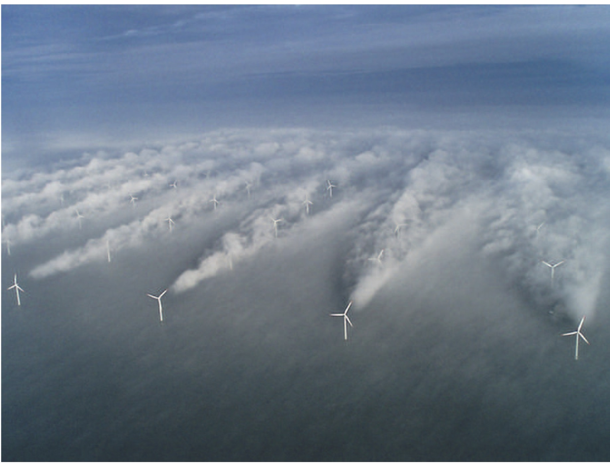 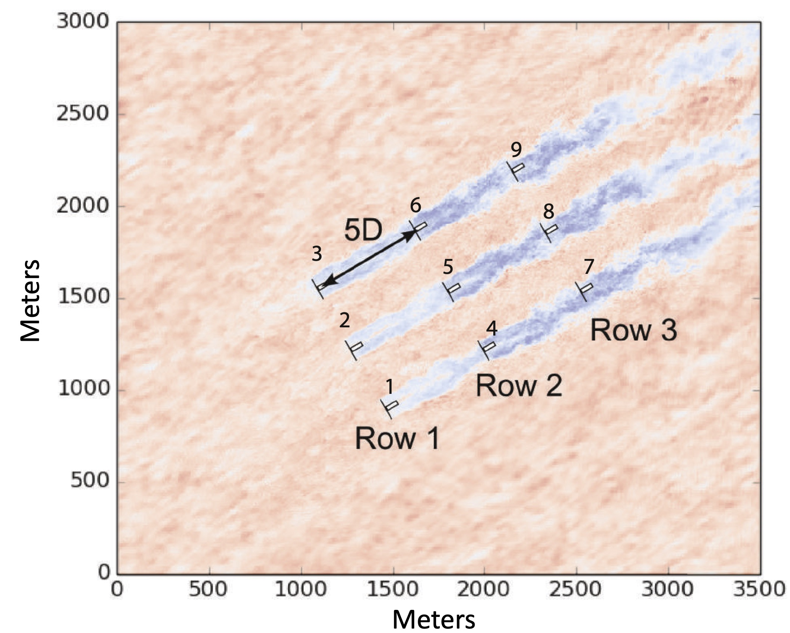
*Fig. 7: Wakes in a wind farm, normally invisible, can be seen in this picture due to very specific weather conditions. Below, a simulation of wakes in a 3-by-3 wind farm, the same geometry considered in this hackathon.*

To this end, in a wind farm each WTG control system is provided with a reference power $P_{\text{ref}}$ to track (in case the controller allows for derated operation), as well as a reference yaw angle $\gamma_{\text{ref}}$. The power reference is computed by the wind farm controller to guarantee that the total wind farm power output matches what is required by the electric grid; the yaw reference allows the wake to be steered away from downstream turbines. How the wind farm controller computes these reference values is outside the scope of this document.

For the purposes of this hackathon, the important point is that the flow of information across a wind farm is as depicted in Fig. 8.

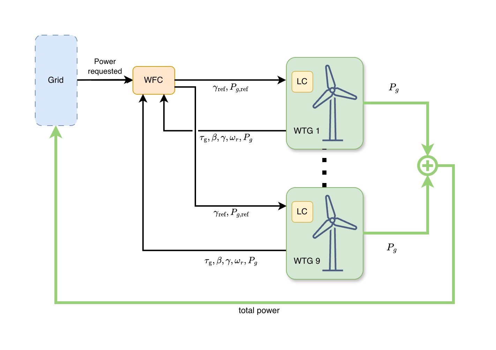
*Fig. 8: Block diagram of a Wind Farm Control system (WFC). Black lines indicate a flow of information, not actual physical variables. Dark green lines indicate the actual flow of power from the turbines to the power grid. The summation node represents, in a real WF, an electrical substation. Here, we assume that only 9 turbines are present.*

### Parameters of simulated WTGs and WF

A wind farm comprising 9 WTGs will be simulated. The dynamics of each WTG and the internal workings of its LC are implemented via a custom Simulink model. The wake interactions between turbines are simulated using OFF, which is a fast control-oriented model developed by TUD.

> Becker, M., Lejeune, M., Chatelain, P., Allaerts, D., Mudafort, R. and van Wingerden, J.W., 2025. A dynamic open-source model to investigate wake dynamics in response to wind farm flow control strategies. *Wind Energy Science*, 10(6), pp.1055-1075. [DOI](https://doi.org/10.5194/wes-10-1055-2025)

The parameters of the simulated WTG and WF are provided in the following tables.

<i> Table 1: Parameters of the simulated WTG. </i>

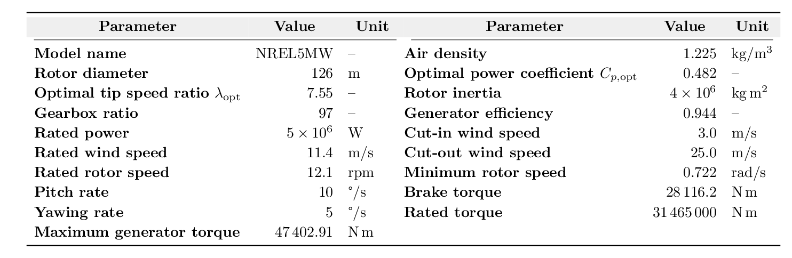

<i> Table 2: Parameters of the simulated Wind Farm. </i>

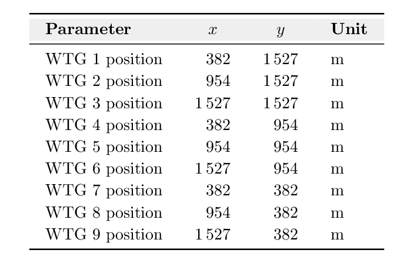

To help interpret how the turbines interact with each other, the wind farm layout is also shown graphically in Fig. 9. The figure indicates the relative positions of the turbines and highlights where wake interactions are expected to be stronger or weaker, depending on the incoming wind direction. In general, turbines that are aligned with the wind direction experience more wake overlap, while turbines that are laterally displaced from one another are less directly affected by upstream wakes.

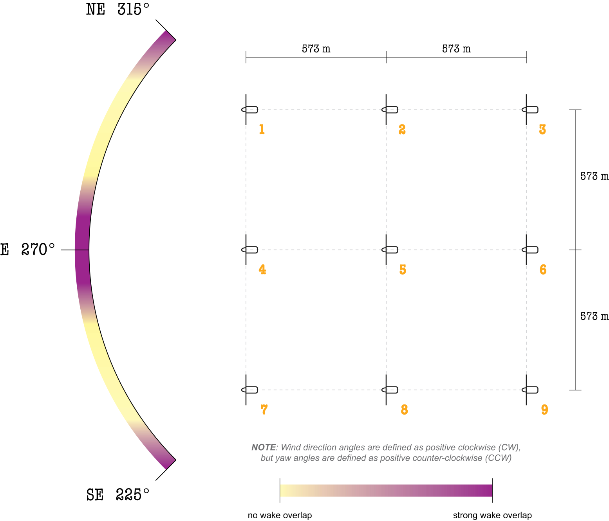
*Fig. 9: Layout of the simulated 3-by-3 wind farm. The turbine positions correspond to the coordinates listed in Table 2. Furthemore, the strength of wake effects is illutrated for a range of wind directions.*

## Cyber domain: description of the ICS hardware and software architecture

The interconnection of hardware and software components of an ICS is usually represented via the so-called ISA-95 [automation pyramid](https://www.isa.org/standards-and-publications/isa-standards/isa-95-standard) (Fig. 10).

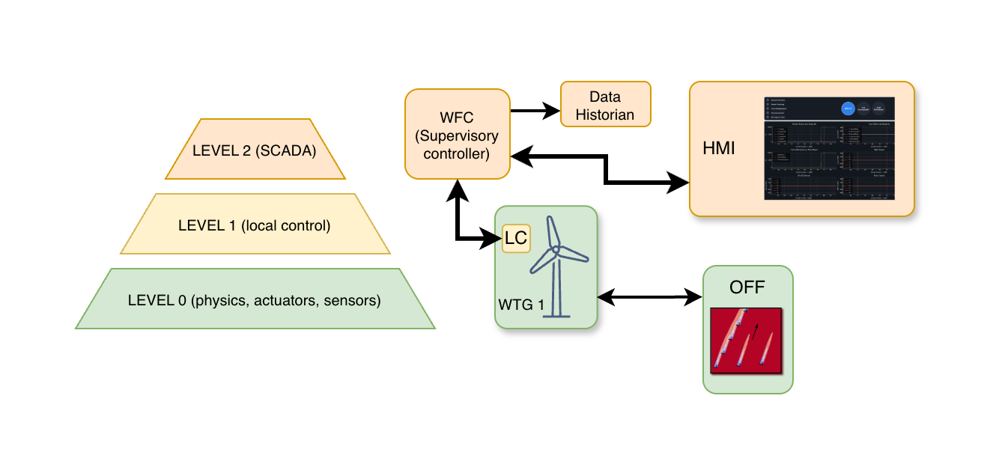 *Fig. 10: First three levels of the ISA-95 automation pyramid (left) and hardware and software components implemented in the hackathon (right).*

We follow this convention here and present the components implemented in this hackathon. More details are presented in the following subsection.

#### Level 0

Level 0 represents the physical domain and the components directly connected to it, such as actuators and sensors. At this level, we find:

* The WTGs, which in this case are simulated using physics-based models
* The wind field and the wake interactions between turbines, which are simulated using OFF

#### Level 1

Level 1 includes the LC of each WTG. In the present hackathon, the LCs are not implemented physically, but are simulated together with their WTGs. The internal details and signals of the LCs are outside the scope of this document.

#### Level 2

Level 2 implements the SCADA. Three different components that are part of a typical SCADA are implemented: a supervisory controller corresponding to the WFC described earlier, a data historian, and a Human Machine Interface (HMI).

### Detailed implementation

The ICS architecture described above has been implemented across three different hardware devices (Fig. 11): a real-time simulator from Speedgoat, an Industrial PC (IPC) from Beckhoff, and one or more ordinary PCs running Windows 10. In case you are interested, we can provide IP addresses and TCP/UDP ports that are used for specific communication links.

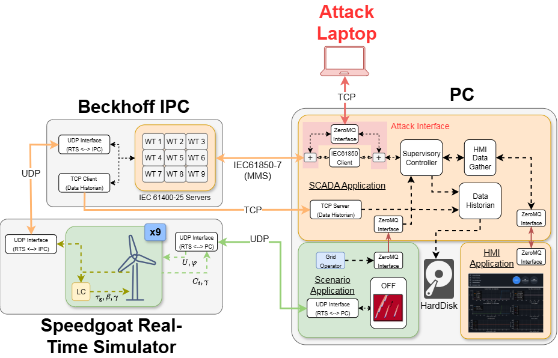 *Fig. 11: Detailed implementation of the ICS over three different devices. Orange lines represent Level 2 communications that can be used by participants to implement a Man-in-the-Middle (MitM) attack. Green lines represent communication that would not be present in a real system, but is required here for the simulation of the physical domain. The red line represents direct access to the provided attack interface. Dashed lines denote interprocess communication between different tasks inside a device.*

#### Speedgoat real-time simulator

[Speedgoat](https://www.speedgoat.com/) produces a line of real-time target machines for rapid control prototyping (RCP) and hardware-in-the-loop (HIL) tests. In the present setup, we use a Speedgoat to simulate all 9 WTGs and their local controllers in real time, with an internal refresh frequency of XX Hz. Reference values $P_{\text{ref}}$ for the power to be produced and $\gamma_{\text{ref}}$ for the yaw angles are communicated via UDP from the Beckhoff IPC. The same protocol is used to communicate back all the WTG variables of interest (e.g. rotor speed, power produced, etc.). Furthermore, the Speedgoat communicates via UDP with one PC where another real-time simulation is run, which implements the dynamical behaviour of the wind flow and the wake interactions. The Speedgoat receives the local wind speed $U$ and direction $\varphi$ for each turbine from the PC, and communicates back the turbine yaw angle $\gamma$ and the coefficient $C_t$, which accounts for the drag force that slows down the wind flow when it passes the turbine.

#### Beckhoff Industrial PC (IPC)

[Beckhoff](https://www.beckhoff.com/) produces a complete line of hardware and software for ICS. In the present setup, we use an Industrial PC that provides an interface between the SCADA and the LCs of all turbines. The communication between the IPC and the SCADA is based on the standard IEC 61850. The data model follows the standard IEC 61400-25 for wind farm control. The other side of the interface, towards the Speedgoat, is implemented via a custom UDP connection. The IPC furthermore communicates with the data historian on the SCADA machine via a TCP/IP channel.

#### PC(s)

Other components of the SCADA, namely the wind farm control algorithm and the data historian, are implemented on one or more PC(s). The wind farm controller also includes a series of anomaly detection algorithms. These functions are part of the binary called the *SCADA application*.  The HMI is implemented separately in a binary called the *HMI application*.

The PC also implements a separate task, called the *Scenario application*, for simulating the wind conditions and grid-side demand in real time. Furthermore, the PC implements a custom attack interface that can be used to carry out a MitM attack without requiring complex hacking skills. The attack interface is further described [here](https://github.com/ivovs-tud/_privateAttackInterface.git).

## Resources and goals for the participants

You will be provided with access to two benchmark systems, each comprising all the hardware and software components described previously. This will allow two teams to work independently at the same time.

### The following regulations apply

* No destructive actions are allowed. Permanently deleting files, flashing devices, or otherwise making part of the setup unusable is not allowed.

### Goals

* Negatively affect the wind farm operation without triggering any alarm from the SCADA.
* Participants can use the provided attack interface to carry out a MitM attack, or they can implement it directly.
* Provided that the regulation above is followed, participants can also reach their goal by compromising either the IPC or the SCADA PC(s), but not the Speedgoat real-time simulator nor the *Scenario application* on the PC.
