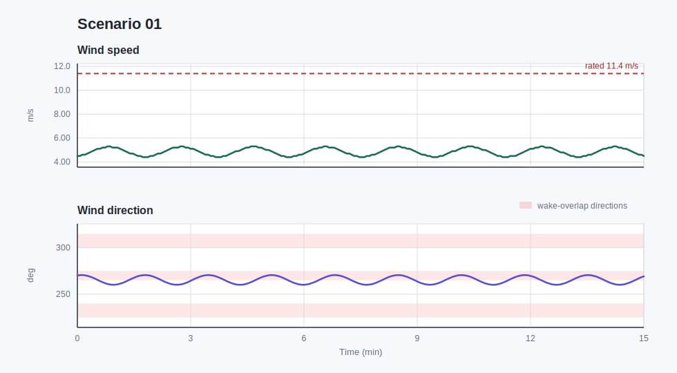
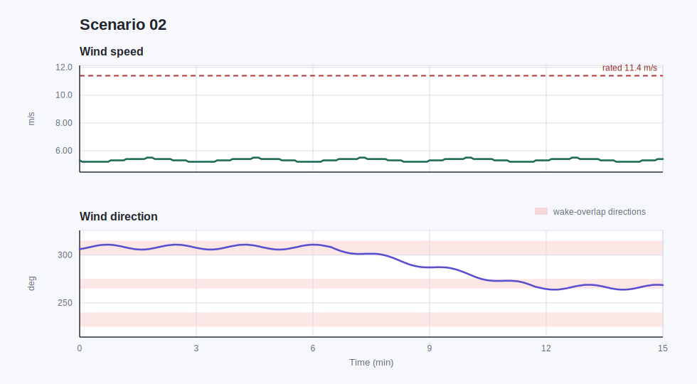
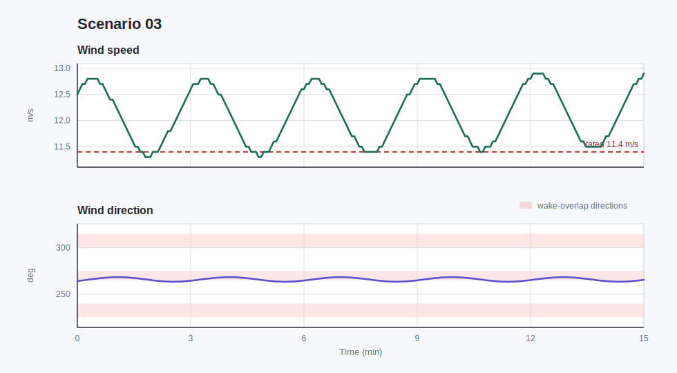
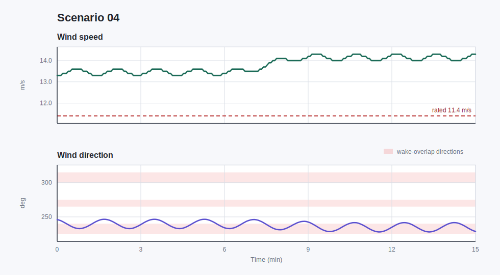
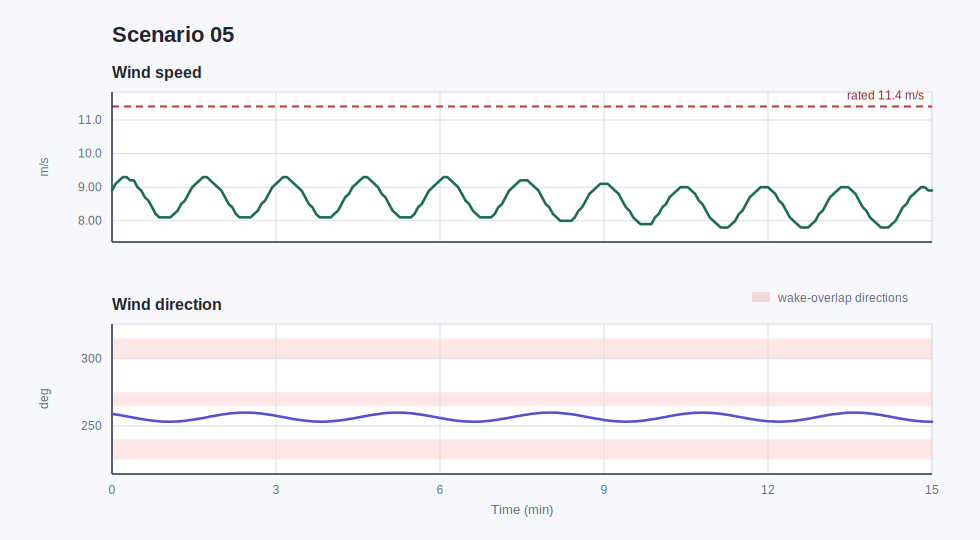
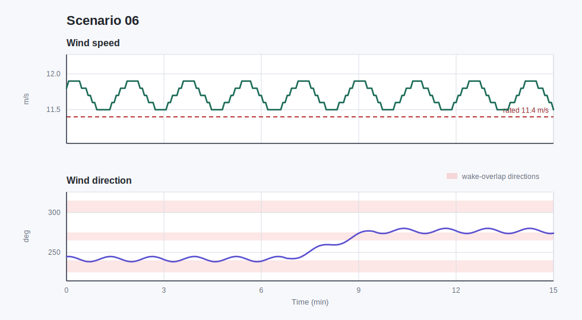
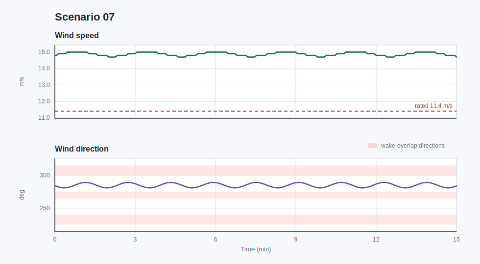
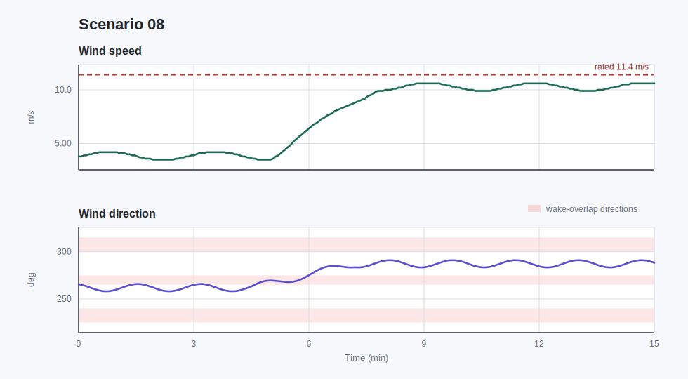
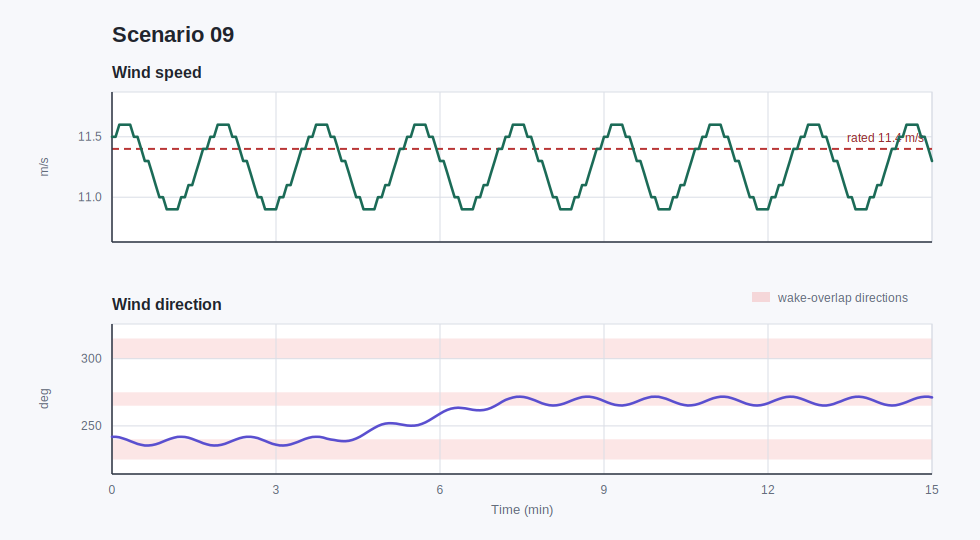
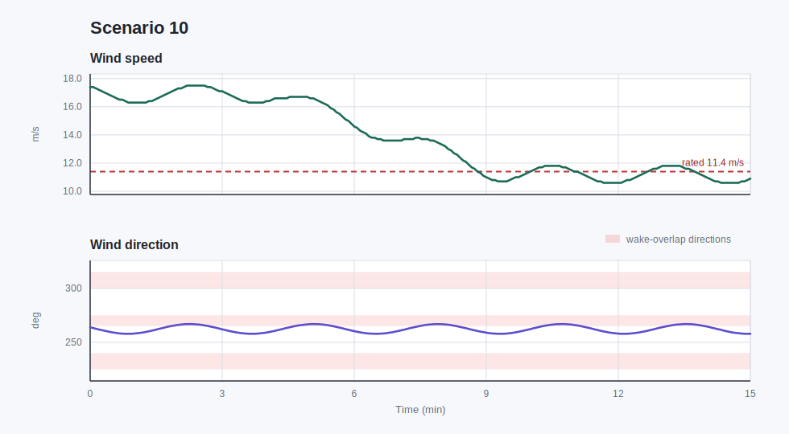

# Ambient Scenarios

During the hackathon, the wind farm will be exposed to a range of ambient conditions. Here, *ambient conditions* refers to the wind speed, wind direction, and turbulence intensity (TI) of the incoming flow. In addition to these wind conditions, the total power requested by the grid may also vary over time.

Even when the wind farm is operating in what we call a steady state, these quantities are not perfectly constant. They usually oscillate slightly around a nominal value, and in some cases one or more of them may undergo a larger change. We refer to each such operating episode as a **scenario**. A scenario therefore describes the qualitative situation faced by the wind farm: for example, whether the wind direction causes strong wake overlap, whether the wind speed is below or above rated, whether the inflow is smooth or turbulent, and whether the grid is requesting a high or low amount of power.

These scenarios matter because they change how the farm can operate. A shift in wind direction can move wakes onto different downstream turbines, while a change in requested power can force the farm to downregulate instead of producing all available wind power. During normal operation, scenarios occur randomly. To test an attack under a specific condition, a selected scenario can be replayed.

The scenarios below each last $900\mathrm{s}$, or $15\mathrm{min}$. Each plot shows the wind speed and wind direction from the corresponding YAML file. The dashed red line in the wind-speed panel marks the rated wind speed, $11.4\mathrm{m/s}$. The light red bands in the wind-direction panel indicate **overlap** directions, where the turbine rows are more closely aligned with the incoming wind and wake overlap is therefore expected to be stronger: $225^\circ$-$240^\circ$, $265^\circ$-$275^\circ$, and $300^\circ$-$315^\circ$. The **no-overlap** directions used in these scenarios are $240^\circ$-$265^\circ$ and $275^\circ$-$300^\circ$, where the wakes are expected to pass less directly through downstream turbines.

TI is constant in all of these files; a larger TI indicates a more turbulent incoming flow. The requested farm power is also constant in each scenario and is therefore reported in the text rather than plotted.

## Scenario 01: overlap, below-rated wind, low TI

The wind speed stays below rated, varying gently between $4.4$ and $5.3\mathrm{m/s}$. The direction remains in an overlap-prone sector, oscillating around $260.1^\circ$-$270.6^\circ$ without a major directional transition, so wake interactions are expected to remain consistently relevant. The requested power is constant at $44.34\mathrm{MW}$. TI is low and constant at 0.09, so the flow is comparatively smooth throughout the scenario.

## Scenario 02: overlap direction change, below-rated wind, high TI

The wind speed remains below rated and nearly steady, staying between $5.2$ and $5.5\mathrm{m/s}$. The wind direction changes strongly from about $306^\circ$ toward $269^\circ$, moving through an overlap-prone alignment and changing which turbines are most exposed to wakes. The requested power is constant at $11.55\mathrm{MW}$. TI is high and constant at 0.17, so the inflow is more turbulent even though the mean wind speed barely changes.

## Scenario 03: overlap, at-rated wind speed change, low TI

The wind speed is around rated conditions and gradually rises from $12.5$ to $12.9\mathrm{m/s}$, with a full range of $11.3$-$12.9\mathrm{m/s}$. The wind direction stays almost fixed in an overlap-prone sector, around $263.4^\circ$-$268.3^\circ$, so wake geometry is mostly stable. The requested power is constant at $14.31\mathrm{MW}$. TI is low and constant at 0.09, so the main ambient change is the wind speed rather than turbulence.

## Scenario 04: overlap direction change, above-rated wind speed change, high TI

The wind speed is above rated and increases from $13.3$ to $14.3\mathrm{m/s}$. The wind direction changes from about $246^\circ$ toward $229^\circ$, staying in a range where wake overlap can matter but shifting the wake pattern across the farm. The requested power is constant at $27.07\mathrm{MW}$. TI is high and constant at 0.16, so the turbines experience both strong mean wind and a turbulent inflow.

## Scenario 05: no-overlap, below-rated wind speed change, low TI

The wind speed is below rated and changes modestly within $7.8$-$9.3\mathrm{m/s}$, returning close to its starting value by the end. The wind direction stays in a no-overlap sector, drifting gently from about $259^\circ$ to $253^\circ$, so direct wake alignment is reduced compared with overlap cases. The requested power is constant at $9.19\mathrm{MW}$. TI is low and constant at 0.09, meaning turbulence is not the dominant feature.

## Scenario 06: no-overlap direction change, at-rated wind, high TI

The wind speed is near rated and nearly steady, staying between $11.5$ and $11.9\mathrm{m/s}$. The wind direction changes substantially, from about $245^\circ$ to $274^\circ$, moving across no-overlap alignments and therefore changing the wake layout without much mean-speed change. The requested power is constant at $39.64\mathrm{MW}$. TI is high and constant at 0.18, the highest value in this set, so the inflow is persistently turbulent.

## Scenario 07: no-overlap, above-rated wind, low TI

The wind speed is above rated and very steady, staying between $14.7$ and $15.0\mathrm{m/s}$. The direction remains in a no-overlap sector, around $281.0^\circ$-$289.2^\circ$, with only small oscillations. The requested power is constant at $13.13\mathrm{MW}$. TI is low and constant at 0.07, the lowest value in this set, so this is a smooth, high-wind scenario with relatively stable wake geometry.

## Scenario 08: no-overlap direction and wind speed change, high TI

The wind speed changes strongly from below rated toward higher below-rated operation, rising from $3.8$ to $10.6\mathrm{m/s}$ over the scenario. The direction also changes, moving from about $266^\circ$ to $288^\circ$, so both available wind power and wake geometry evolve at the same time. The requested power is constant at $34.28\mathrm{MW}$. TI is high and constant at 0.14, so the increasing wind field remains turbulent throughout.

## Scenario 09: overlap direction change, broad wind-speed region, low TI

The wind speed stays close to rated conditions, varying only between $10.9$ and $11.6\mathrm{m/s}$. The direction changes from about $242^\circ$ to $271^\circ$, ending in a more overlap-prone alignment and shifting which turbines sit downstream of others. The requested power is constant at $14.37\mathrm{MW}$. TI is low and constant at 0.09, so the notable change is the wind direction rather than turbulence or speed.

## Scenario 10: no-overlap wind speed change across operating regions, high TI

The wind speed changes strongly, falling from $17.4$ to $10.9\mathrm{m/s}$ and spanning above-rated to near-rated operation. The wind direction remains in a no-overlap sector, drifting from about $264^\circ$ to $258^\circ$ with no large transition. The requested power is constant at $18.74\mathrm{MW}$. TI is high and constant at 0.18, so the flow remains very turbulent while the available wind power decreases.
